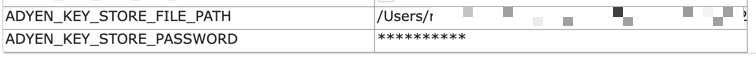
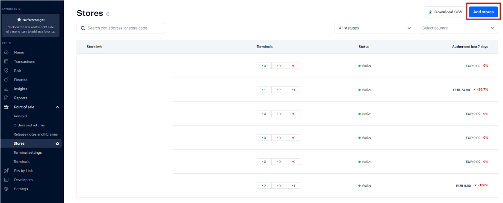
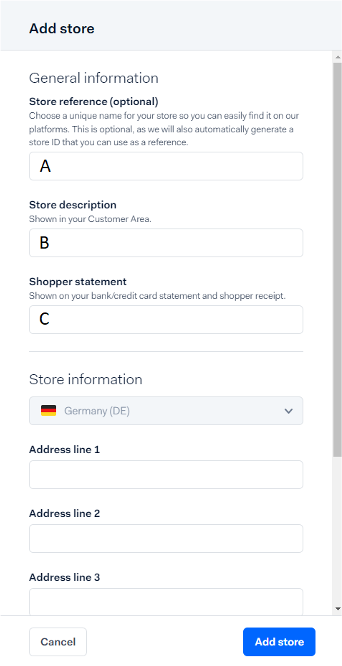
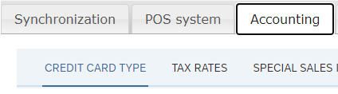
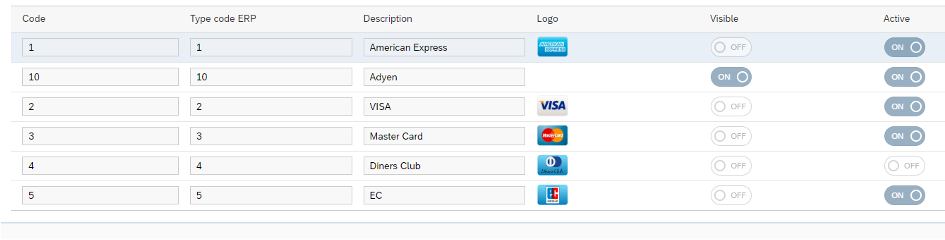
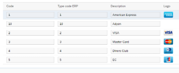
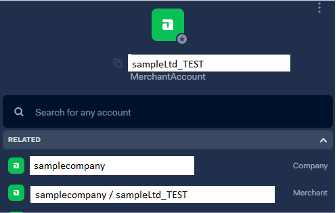
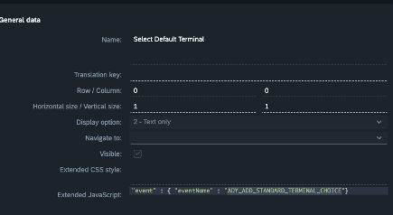
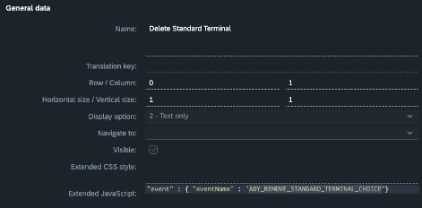
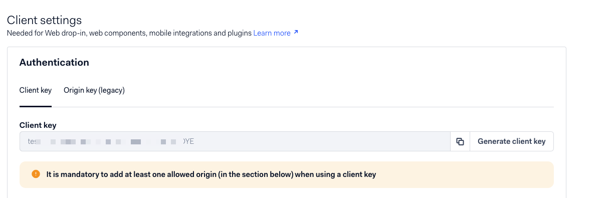

# Adyen SAP Customer Checkout

___


**<span style="color:red">IMPORTANT CHANGES</span>**

With Version 1.1.0 of the plugin the handling of the adyen certificates was changed. A java keystore is introduced.

With Version 1.1.1 of the plugin SAP CCO FP16 and FP17 is not supported anymore.
  
With Version 1.3.1 the Adyen SAP CCO Integration requires Java 17!

## Prerequisites

___

* [Adyen Test Account](https://www.adyen.com/signup)
* Adyen Payment terminal
* SAP Customer Checkout
* [Adyen API Key](https://docs.adyen.com/development-resources/how-to-get-the-api-key) (if dynamic terminal choice is used)

## Installation and Configuration

___

### Plugin Installation

 **<span style="color:red">Prior to version 1.1.0</span>** 

Download the Adyen certificates from [here]((https://docs.adyen.com/point-of-sale/design-your-integration/choose-your-architecture/local/#install-root-cert)), rename them as shown and place them also in the AP folder.


**<span style="color:red">With version 1.1.0 and later</span>**

Certificates are now automatically provided by the plugin with the certificates that were released by adyen at the day of the plugin release.   
The plugin will automatically create a java keystore file in CCOs AP folder. 

You can also define a different path to the java keystore containing the adyen certificates as well as a different password with the two new plugin properties:   
* ADYEN_KEY_STORE_FILE_PATH
* ADYEN_KEY_STORE_PASSWORD
   


Please restart CCO if you changed anything related to the key store.

#### Changing certificates in Java Keystore

Certificates usually have a valid to date. In case of the current adyen certificates it is 2048. In the unlikely event, that these certificates   
need to be updated in the keystore, please follow these instructions. You can also use tools like "[keystore explorer](https://keystore-explorer.org/)" if you are unfamiliar with cli commands.
   
##### Certificates to be imported
  - adyen-live.pem -> **Entry name:** adyen-terminalfleet-live
  - adyen-test.pem -> **Entry name:** adyen-terminalfleet-test

##### Prerequisites

1. **Java Development Kit (JDK)**
   1. The "keytool" command-line utility is included in the JDK.
   2. Ensure JDK is installed and added to your system path.
   3. If not installed, refer to official documentations on how to install JDK.
2. **Existing Java Keystore (adyen-cco-plugin.jks)**
   1. If the file does not exist, it will be created when the adyen plugin is loaded from CCO.
3. **Keystore Password**
   1. You must know or be in possession of the keystore password.

##### Steps to import or Update certificates

###### Windows & macOS

1. Open **Command Prompt (cmd.exe)** as Administrator in Windows or the terminal in macOS
2. Navigate to the directory containing the keystore and the certificates usually CCOs AP folder
   1. ```cd path\to\APfolder```
3. Import or update the adyen-live.pem certificate:
   1. ```keytool -importcert -trustcacerts -alias adyen-terminalfleet-live -file adyen-live.pem -keystore adyen-cco-plugin.jks -storepass YOUR_KEYSTORE_PASSWORD -noprompt```
4. Import or update the adyen.test.pem certificate:
   1. ```keytool -importcert -trustcacerts -alias adyen-terminalfleet-test -file adyen-test.pem -keystore adyen-cco-plugin.jks -storepass YOUR_KEYSTORE_PASSWORD -noprompt```
5. Verify that both certificates are correctly imported:
   1. ```keytool -list -keystore adyen-cco-plugin.jks -storepass YOUR_KEYSTORE_PASSWORD``` 

Restart CCO and look for any error messages from the plugin while CCO starts up. 


### Adding a store in Adyen backend

Please log into your adyen account and create a new store for your merchant account.





**A:** Add Store reference for example e.g. A25

**B:** Add Store description

**C:** Add information which is shown on the shopper receipt

Add address and phone number and add the store. Afterwards assign your terminal to your newly created store. 
To achieve this, go to In-person payments -> Terminals. Click on the button "..." of the terminal and choose "Reassign".

### Terminal configuration

Connect your terminal to your local network. Either with LAN or via Wifi. Please consult the manuals for your specific terminal [here]([Get started manuals | Adyen Docs](https://docs.adyen.com/point-of-sale/user-manuals/)).

*Note: Usually the terminal has to be in the same network as the CCO instance. If this is not the case or not possible, please talk to your network administrators.*

### SAP Customer Checkout Configuration

Start your SAP CCO instance, login as User with administrative privileges and go to the configuration backend. In the tab *Accounting* open the subtab *Credit Card Type*.





Add a new credit card which will trigger the payment transaction on the adyen terminal. The card can be called *Adyen* but you can name the new card as you like. Set the visibility of all other cards (except the ones not handled by the payment terminal) to Visible = OFF but keep them active. The *Adyen* card should be visible.

### Plugin Configuration


| **KEY**                                                             | VALUES                                                                                                                                                                                                                                                                                                                                                                                                                                                                                                                                                                                                                                                                                                                                                                                                                                                      |
|---------------------------------------------------------------------|-------------------------------------------------------------------------------------------------------------------------------------------------------------------------------------------------------------------------------------------------------------------------------------------------------------------------------------------------------------------------------------------------------------------------------------------------------------------------------------------------------------------------------------------------------------------------------------------------------------------------------------------------------------------------------------------------------------------------------------------------------------------------------------------------------------------------------------------------------------|
| ADYEN_ACTIVATE_DYNAMIC_TERMINAL                                     | *true / false*<br/>If *true* is selected, the terminal is not linked to a single POS. When by card at the checkout, the cashier is asked which terminal should be used. This can be usefull, if you use CCO on a tablet and the POS has not a fixed location in the store.<br/><br/>*Note: The API Key has also be provided.*                                                                                                                                                                                                                                                                                                                                                                                                                                                                                                                               |
| ADYEN_ACTIVATE_UNREFERENCED_REFUNDS                                 | *true / false*<br/>Handles refunds only allowed with a referenced payment from an older receipt. This has to be activated by Adyen. Please consult your Adyen contact person.                                                                                                                                                                                                                                                                                                                                                                                                                                                                                                                                                                                                                                                                               |
| ADYEN_API_KEY                                                       | *XSA2342FEFASFEF*<br/>This can be created in your Adyen backend in the section *Developers / API credentials*.<br/><br/>*Note*: The permission to use the terminal management API has to be activated by Adyen. Please consult your Adyen contact.                                                                                                                                                                                                                                                                                                                                                                                                                                                                                                                                                                                                          |
| ADYEN_CARD_MAPPING<br/>   | *mc=3;amex=1;visa=2;visa_applepay=2;maestro=5*<br/>The adyen terminal will respond with an alphanumeric code as represenation for the card being used. The codes can be found [here](https://docs.adyen.com/development-resources/paymentmethodvariant/). This alphanumeric code has to be mapped to a specific credit card in CCO. <br/>The mapping works with an imaginary wildcard. This means, if you want to map all visa payment methods to CCO card 2 except visa_applepay and visabusiness, the mapping for visa could look like this:<br/><br/>visa=2;visa_applepay=3;visabusiness=5                                                                                                                                                                                                                                                               |
| ADYEN_COMPANY_ACCOUNT                                               | samplecompany<br/>The ID of your company. Seen in the Adyen Backend.<br/>                                                                                                                                                                                                                                                                                                                                                                                                                                                                                                                                                                                                                                                                                                                                   |
| ADYEN_CREATE_NEW_ABSTRACT_PAYMENT_ITEM                              | *true / false*<br/>If false is selected, after a failed card payment, the cashier can choose a different payment method for the next try e.g. cash. If true is selected, the plugin will automatically add a new payment item of type card payment to retry the payment on the terminal.                                                                                                                                                                                                                                                                                                                                                                                                                                                                                                                                                                    |
| ADYEN_EXCLUDE_CARD_IDS                                              | *1;1337;9234*<br/>Codes of CCO credit cards, that should not be handled by the adyen terminal.                                                                                                                                                                                                                                                                                                                                                                                                                                                                                                                                                                                                                                                                                                                                                              |
| ADYEN_FALLBACK_CARD                                                 | *3*<br/>Indicates which credit card should be used, if the terminal responds with a payment method which is not mapped in ADYEN_CARD_MAPPING.                                                                                                                                                                                                                                                                                                                                                                                                                                                                                                                                                                                                                                                                                                               |
| ADYEN_FALLBACK_SERIAL_NUMBER                                        | *AMS1-00000000000000000*<br/>Serial number of the payment terminal which is used when ADYEN_ACTIVATE_DYNAMIC_TERMINAL is set to false.<br/><br/>*Note: The serial number of the terminal is visible in the adyen backend. It's **not** the serial number printed on the device itself!*                                                                                                                                                                                                                                                                                                                                                                                                                                                                                                                                                                     |
| ADYEN_FALLBACK_TERMINAL                                             | https://192.168.13.37<br/>Specifies the IP address of the payment terminal which is used when ADYEN_ACTIVATE_DYNAMIC_TERMINAL is set to false.                                                                                                                                                                                                                                                                                                                                                                                                                                                                                                                                                                                                                                                                                                              |
| ADYEN_IS_TEST_ENV                                                   | *true* / false<br/>Set this property according to the intended use.                                                                                                                                                                                                                                                                                                                                                                                                                                                                                                                                                                                                                                                                                                                                                                                         |
| ADYEN_KEY_IDENTIFIER<br/>ADYEN_KEY_PASSPHRASE<br/>ADYEN_KEY_VERSION | IDENTIFIER<br/>PASSPHRASE<br/>1<br/>This parameters can be configured either on store level or on terminal level. E.g. go to *In- person payments / Stores  / Integrations* or *In-person payments / Terminals / Integrations*<br/><br/>*Note: For the sake of security please use a generated Identifier and Passphrase and treat them like passwords!*<br/><br/>*Note: When using the ADYEN_DYNAMIC_TERMINAL_CHOICE feature all terminals in one store need to use the same values! Therefore it is recommended to configure this on store level rather than terminal level.*                                                                                                                                                                                                                                                                             |
| ADYEN_MERCHANT_ACCOUNT                                              | *SampleMerchant*<br/>Select your corresponding merchant account Id.<br/>                                                                                                                                                                                                                                                                                                                                                                                                                                                                                                                                                                                                                                                                                                                                    |
| ADYEN_PAYMENT_REFERENCE_PATTERN                                     | *${cco_prefix}*<br/>You can configure how the merchant reference should look like. You can see this in the adyen backend *transactions / payments* in column *Merchant reference*. This can become handy if you need IDs from CCO for mapping payments in your ERP system. <br/><br/>Possible placeholder:<br/>*cco_prefix* - Your CCO prefix<br/>*receipt_id* - Your CCO receipt id<br/>*transaction_amount* - The amount for the payment transaction<br/>*transaction_currency* - The currency for the payment transaction<br/>*transaction_timestamp* - The timestamp of the transaction<br/>*terminal_serial_number* - The serial number of the terminal used<br/>*terminal_display_label* - The configured display label of the terminal<br/><br/>*Note: The string can be max. 80 characters. Any characters exceeding this will not be transferred.* |
| ADYEN_STORE_ID                                                      | *A15*<br/>The ID of the store in which the terminal was boarded.                                                                                                                                                                                                                                                                                                                                                                                                                                                                                                                                                                                                                                                                                                                                                                                            |
| ADYEN_TERMINAL_CONNECTION_TIMEOUT                                   | *10000*<br/>Value in milliseconds how long the plugin will wait for a connection. If you experience slow network connections in your store, please adjust this timeout accordingly.                                                                                                                                                                                                                                                                                                                                                                                                                                                                                                                                                                                                                                                                         |
| ADYEN_TERMINAL_READ_TIMEOUT                                         | *120000*<br/>Value in milliseconds how long the terminal will wait for the shoppers card to be presented.<br/><br/>*Note: The processing time of a payment transaction is included into this timeout. This means the timeout will also occur, if the card was presented at ms 119999 and the processing takes > 1 ms.*                                                                                                                                                                                                                                                                                                                                                                                                                                                                                                                                      |
| ADYEN_PRINT_KEY_FILTER                                              | The terminal will send the merchant and customer payment receipt in a key-value structure. By providing unwanted keys spearated with semicolon, you can hide certain info on the print out. <br/><br/><br/>Available keys can be found [here](https://docs.adyen.com/point-of-sale/basic-tapi-integration/generate-receipts/)<br/><br/>*aid*                                                                                                                                                                                                                                                                                                                                                                                                                                                                                                                |
| ADYEN_USE_TAP_TO_PAY                                                | Flag to activate the Tap2Pay Feature                                                                                                                                                                                                                                                                                                                                                                                                                                                                                                                                                                                                                                                                                                                                                                                                                        |
| ADYEN_PAYMENT_APP_INSTALLATION_ID                                   | Don't set this field. It will be automatically set when the payment app is boarded                                                                                                                                                                                                                                                                                                                                                                                                                                                                                                                                                                                                                                                                                                                                                                          |
| ADYEN_BOARD_PAYMENT_APP_ON_STORE_LEVEL                              | Set this flag if the adyen payments app should be boarded on store level.                                                                                                                                                                                                                                                                                                                                                                                                                                                                                                                                                                                                                                                                                                                                                                                   |
| ADYEN_KEY_STORE_FILE_PATH                                           | Will be set automatically with the first startup. Change only if needed!                                                                                                                                                                                                                                                                                                                                                                                                                                                                                                                                                                                                                                                                                                                                                                                    |
| ADYEN_KEY_STORE_PASSWORD                                            | Will be set automatically initially to "changeit". Please consider changing it in a production environment!                                                                                                                                                                                                                                                                                                                                                                                                                                                                                                                                                                                                                                                                                                                                                                                                         |

Restart your CCO instance after the config. If any mandatory plugin property is missing, you will get a warning after the next login.

### Dynamic Terminal Choice

The dynamic terminal choice feature allows the cashier to dynamically select an active adyen terminal on store level.
In a mobile POS setup, this allows the cashier to work without having to carry a payment terminal, and instead use whichever terminal is currently available nearby.
Or you could share one terminal for multiple CCO instances. Cashiers can select a standard terminal for all upcoming payment transactions until logout or removed manually.  
The manual selection or removing can be achieved with the documented quickselection buttons.

To use the dynamic terminal choice feature, the Adyen API key needs to have the following roles. Some may only be activated by adyen itself.  
Please consult your contact person. 
  
  
* Management API — Stores read
* Management API — Stores read and write
* Management API — Terminal actions read
* Management API — Terminal settings read
* Management API — Terminal settings read and write
* Management API — Terminal actions read

Some restrictions may apply:

* Key identifier, passphrase and key version must be the same on store level for all terminals


### Quickselection Buttons

This is only applicable, if you intend to use the ADYEN_DYNAMIC_TERMINAL_CHOICE feature. With these buttons the cashier can choose his "standard" terminal or delete his prior choice even without an open receipt or running payment transaction.

#### Standard Terminal Choice

Add a new quickselection button in CCO Manager and add the following string into the Extended JavaScript input field.
`"event" : { "eventName" : "ADY_ADD_STANDARD_TERMINAL_CHOICE" }`



#### Remove Standard Terminal

Add a new quickselection button in CCO Manager and add the following string into the Extended Javascript input field.

`"event" : { "eventName" : "ADY_REMOVE_STANDARD_TERMINAL_CHOICE" }`



## Tap2Pay (Android)

With Version 1.3.0 you can use the Tap2Pay feature on android. Contact Adyen to activate the Tap2Pay functionality for your account.  
For further info please consult the official adyen docs [here](https://docs.adyen.com/point-of-sale/mobile-android/build/payments-app/).  
To get SAP Customer Checkout running on android, please contact [Michael Bosch](https://checkout-peak.com/how-to-use-sap-customer-checkout-on-android/) to obtain his CCO-Peak.

### Prerequisites

* Install the adyen payments (test) app via the Google Play Store
* have a SAP CCO running on android
* have file system access to the android device.
* Ensure Android USB-Debugging is off
* Create an API Key with the role "Adyen Payments App Role" and also create a client key (is created on the same page where the api key is created)
  

### Boarding Process

* After the installation of the adyen payments (test) app please open it once.
* Ensure the following plugin properties have been set correctly
    * Company Account
    * Merchant Account
    * Key Identifier 
    * Key Passphrase
    * Key version
    * API Key
    * Keystore file path
    * Keystore password
    * Fallback Card
    * Card Mapping
    * Use Tap To Pay
    * Board Payment App on Store level (set to true if payment app should be boarded on store level otherwise it will be boarded on merchant level)
* Add the Quick selection buttons to a specific quick-selection ui, preferably not the one the cashier uses
* reboot CCO
* Make sure no configuration errors occurred after login
* Click on the board app button
    * first app switch will appear
    * the first app switch is used to ask the app for its boarding status
    * CCO UI will be visible again with a loading indicator
    * boarding can take some time...
    * When CCO receives the boarding response the loading indicator will disappear and after some seconds the last app switch will occur
    * The payment app should now show a screen "Setup complete. Forward to POS App in 5 seconds."
    * CCO UI is visible again
    * When the Adyen payment (test) app is now opened it should show a screen "Ready to accept payments".
    * Note: In some cases it was necessary to close the payment app and open it again after boarding otherwise no payment was possible
    * Note: In some cases it was also necessary to restart CCO
    * Note: In some cases it was also necessary to clear the App Cache of the adyen payment (test) app

### Unboarding Process

In case you want to unboard a boarded adyen payment app, please use the following flow:

* Click on unboard app button
    * No app switch will occur, the app will not accept payment transactions anymore
    * Note: Once the app is unboarded you will need to uninstall it, download it from the Play Store again and go through the boarding process again

### Quickselection Buttons

Please be aware, that the board and unboard buttons should only be visible for administrative users not for cashiers!

Board app:

`"event" : { "eventName" : "ADY_BOARD_PAYMENT_APP" }`

Unboard app:

`"event" : { "eventName" : "ADY_UNBOARD_PAYMENT_APP" }`

### Translations

The Adyen plugin automatically deploys standard translations in the /cco/POSPlugins/translations folder. You can change the translations to your liking. 

*Note: Your translations files and changes will never be overwritten. So please check when using a newer version of the plugin, if new translation keys are present. E.g. rename the modified translation file, restart CCO so the plugin will deploy the new translation file with the original name.*

 

## Troubleshooting

The plugin writes messages into the SAP CCO log file. If any error occurs please consult the log file. This includes any error in the payment dialog in CCO.

### Error Codes

| ErrorCode     | Cause                             | Solution                                           |
| ------------- | --------------------------------- | -------------------------------------------------- |
| ADY:ERR:1100  | The merchant account was not set  | Set the merchant account in the plugin properties  |
| ADY:ERR:11001 | The company account was not set   | Set the company accoun in the plugin properties    |
| ADY:ERR:11002 | The fallback card was not set     | Set the fallback card id in the plugin properties  |
| ADY:ERR:11003 | The key identifier was not set    | Set the key identifier in the plugin properties    |
| ADY:ERR:11004 | The fallback terminal was not set | Set the fallback terminal in the plugin properties |
| ADY:ERR:11005 | The passphrase was not set        | Set the passphrase in the plugin properties        |
| ADY:ERR:11006 | The key version was not set       | Set the key version in the plugin properties       |
| ADY:ERR:11007 | The api key was not set           | Set the api key in the plugin properties           |

## changelog


***Changes***

<span style="color:red">The changelog moved to Github Releases!</span>  

***2024-07-30***

* Improvement: The plugin will log at startup which version is started
* Improvement: Logout of cashier user will delete the standard terminal choice when using dynamic terminal choice is active
* Bugfix: Setting a standard terminal when no receipt was open resulted in an error

provided adyenplugin-1.0.24-FP18 - suitable for CCO FP18 to FP20  
provided adyenplugin-1.0.24-FP16 - suitable for CCO FP16 & FP17

***2024-04-12***  

* Improvement: Actual values of card payments are now entered automatically. Thus, there should be no discrepancies in the daily closing.  
* Improvement: Chosen standard terminal will be saved even after cashier logged out once.
* Improvement: Return of a receipt with copied payment item which was originally paid with adyen will now open the terminal choice dialog if dynamic terminal choice is active.  
* Improvement: Card mapping works now like a regex. E.g. visadebit, visa, visacredit, visa_applepay... will now be mapped with a single visa=2  
  If visacredit should be mapped to another CCO card, this can be done with visa=2;visacredit=23
* Bugfix: Changing the CreditCardTypeCode could lead to an error in cashdesk closing when receipts were already posted with this card.

provided Plugin adyenplugin-1.0.23-FP18 - suitable for CCO FP18 & FP19  
provided Plugin adyenplugin-1.0.23-FP16 - suitable for CCO FP16 & FP17

***IMPORTANT***  
adyenplugin-1.0.20-FP14 is out of maintenance!

***2023-12-21***  

* Improvement: warning message when fall back terminal is used is now only shown when no dynamic terminal feature is activated.  
* Bugfix: Terminal choice was shown on every split card payment. Final payment was done on last choice. Now first choice will be used and no further dialogs appear.  

provided Plugin adyenplugin-1.0.20-FP18  
provided Plugin adyenplugin-1.0.20-FP16  
provided Plugin adyenplugin-1.0.20-FP14

***2023-09-06***  
provided Plugin adyenplugin-1.0.12-FP16 - suitable for CCO FP16 and FP17

***2023-08-25***  
provided Plugin adyenplugin-1.0.12-FP16 - suitable for CCO FP16  
provided Plugin adyenplugin-1.0.12-FP14 - suitable for CCO FP14 and FP15 
